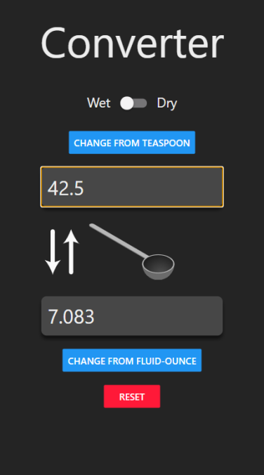

# Converter

An app that can convert measurements ie from teaspoon to table spoon. Has two options, wet and dry parts

Click on the blue buttons to cycle through different items. Click Reset to set values back to nothing

## Use

To start emulation, use `expo start`

## Lib

* convert-units

## React Native Notes

* View = div
* Text = p
* styles can be mounted with a `StyleSheet.create`
* TextInput = input
* Image = img
* TouchableOpacity = a div that can trigger something via click

